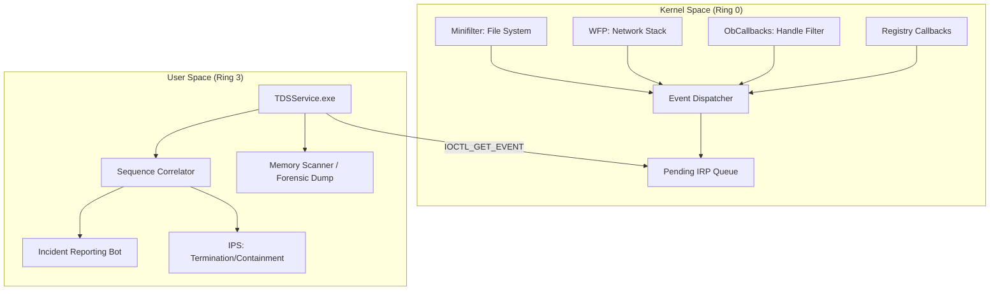

# Threat Detection Suite (TDS) - v4.10.0 (April 2026)

Event-driven Endpoint Detection and Response (EDR) framework for Windows. This suite implements low-level kernel interception and high-fidelity user-mode analysis without relying on polling or expensive system-wide hooks.

## Technical Architecture Overview

TDS operates on a tiered interception model, utilizing an **Inverted Call Model** for IPC. This ensures that the kernel driver can "push" events to the user-mode service with minimal latency, critical for preventing race conditions in malicious process execution.



## Core Subsystems

### 1. Kernel Interceptor (TDSDriver.sys)
Implemented using the Windows Driver Model (WDM) and Filter Manager.
- **Process Protection**: Utilizes `ObRegisterCallbacks` to strip dangerous access rights (`PROCESS_CREATE_THREAD`, `PROCESS_VM_OPERATION`, `PROCESS_DUP_HANDLE`) from handles targeting protected processes.
- **LSASS Shield**: Enforces strict path validation (`\Device\HarddiskVolume...`) to prevent path-spoofing evasion of the Local Security Authority Subsystem Service.
- **WFP Integration**: Native callouts for IPv4/v6 and UDP/DNS. Intercepts traffic at the ALE (Application Layer Enforcement) layers to identify C2 beaconing and exfiltration patterns.
- **Minifilter Guard**: Post-operation interception detects anomalous file modification bursts, specifically targeting ransomware entropy signatures.

### 2. Detection Engine (TDSService.exe)
A native Windows Service responsible for telemetry orchestration.
- **Sequence Correlator**: State-machine based engine that links discrete events. Detects **Early Bird APC Injection** by correlating process creation in a suspended state with subsequent remote thread/APC queuing before the first `ResumeThread`.
- **Memory Forensics**: Scans for `MZ/PE` signatures in `MEM_PRIVATE` executable regions to detect manual mapping and reflective DLL loading. Agnostic to WOW64/x64 architectures.
- **Real-Time Dispatch**: Uses an asynchronous loop to process pending IRPs from the driver, ensuring the event queue never causes kernel pool exhaustion.

### 3. Forensic Manager
Automated evidence collection triggered by critical severity detections.
- **Atomic MiniDumps**: Uses `MiniDumpWriteDump` from `dbghelp.dll` with `MiniDumpWithFullMemory` to capture the complete memory state of a target process for post-mortem analysis in WinDbg.

## Operational Stability

- **Lock Integrity**: Optimized spinlock hierarchy prevents nested acquisition deadlocks.
- **Queue Limits**: Strict `EVENT_QUEUE_LIMIT` (5000 events) prevents memory exhaustion during DoS attacks.
- **Unload Safety**: Implements clean filter teardown and IRP cancellation routines to ensure zero BSODs during driver updates.

## Technical Stack
- **Languages**: C11 (Kernel), C++17 (Userland).
- **Build System**: CMake with Visual Studio 2022 and WDK integration.
- **Interconnect**: `METHOD_BUFFERED` IOCTLs.

## Deployment Instructions

### Environment Configuration
1. Enable Test Signing: `bcdedit /set testsigning on`
2. Restart the system to allow unsigned driver loading (or use a production cert).

### Compilation
```powershell
mkdir build && cd build
cmake ..
cmake --build . --config Release
```

### Loading the Suite
```powershell
sc create TDSDriver type= kernel binPath= C:\bin\TDSDriver.sys
sc start TDSDriver
net start TDSService
```

## Maintenance and Research
Developed for advanced security research and audit purposes. Finalized April 6, 2026. This suite contains zero simulated logic; all detections are based on native kernel callbacks and telemetry.

---
*Technical Integrity. Event-Driven. April 2026.*
