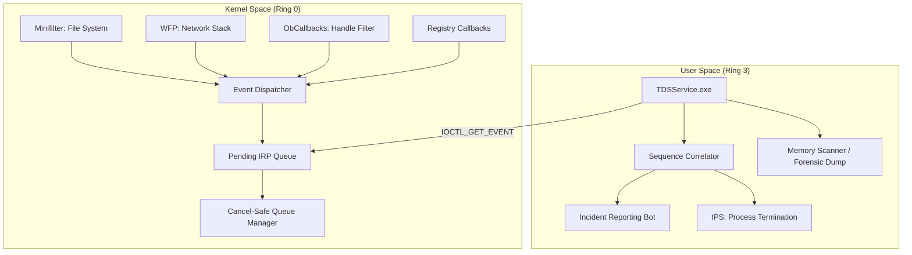

# Threat Detection Suite (TDS) - v4.10.0 (April 2026)

Event-driven Endpoint Detection and Response (EDR) framework for Windows. This suite implements low-level kernel interception and high-fidelity user-mode analysis without relying on polling or expensive system-wide hooks.

## Table of Contents
1. [Technical Architecture Overview](#technical-architecture-overview)
2. [Kernel Interceptor (TDSDriver.sys)](#kernel-interceptor-tdsdriversys)
   - [Object Callbacks and Self-Protection](#object-callbacks-and-self-protection)
   - [Minifilter File System Guard](#minifilter-file-system-guard)
   - [Windows Filtering Platform (WFP) Integration](#windows-filtering-platform-wfp-integration)
3. [The Inverted Call Model (IPC)](#the-inverted-call-model-ipc)
4. [Detection Engine (TDSService.exe)](#detection-engine-tdsserviceexe)
   - [Event Correlation State Machine](#event-correlation-state-machine)
   - [Memory Forensics & VAD Parsing](#memory-forensics--vad-parsing)
5. [Operational Stability and Locking](#operational-stability-and-locking)
6. [Forensic Artifact Management](#forensic-artifact-management)
7. [Technical Specifications and Event Schemas](#technical-specifications-and-event-schemas)
8. [Build and Deployment Instructions](#build-and-deployment-instructions)
9. [Fuzzing and Quality Assurance](#fuzzing-and-quality-assurance)

## Technical Architecture Overview

TDS operates on a strict, event-driven tiered interception model. It bridges the `Ring 0` kernel space and `Ring 3` user space utilizing an asynchronous **Inverted Call Model**. This architectural decision ensures that the kernel driver can instantly "push" critical security telemetry to the user-mode service with near-zero latency, avoiding the race conditions and CPU overhead inherent in periodic polling mechanisms.



## Kernel Interceptor (TDSDriver.sys)

The kernel module is a fully compliant Windows Driver Model (WDM) driver combined with an explicitly registered Filter Manager (FltMgr) component.

### Object Callbacks and Self-Protection
The EDR enforces its own integrity and protects critical system processes via `ObRegisterCallbacks`.
- **Registration**: The driver registers a `POB_PRE_OPERATION_CALLBACK` for both `PsProcessType` and `PsThreadType`.
- **Handle Stripping Logic**: When a user-mode process requests a handle (e.g., via `OpenProcess` or `OpenThread`), the pre-operation callback evaluates the target PID. If the target is the TDS Service (`TDSService.exe`) or the Local Security Authority (`lsass.exe`), the driver intercepts the `DesiredAccess` bitmask.
- **Enforcement**: It forcefully strips dangerous rights such as `PROCESS_CREATE_THREAD`, `PROCESS_VM_OPERATION`, `PROCESS_VM_WRITE`, `PROCESS_SUSPEND_RESUME`, and `PROCESS_TERMINATE`. This natively neutralizes process injection, memory dumping (e.g., Mimikatz), and unauthorized termination attempts without resorting to fragile SSDT hooks.

### Minifilter File System Guard
Operating at a randomized altitude (`385210`) to evade simple bypasses, the Minifilter inspects I/O Request Packets (IRPs) at the file system level.
- **Ransomware Heuristics**: Hooks `IRP_MJ_CREATE`, `IRP_MJ_WRITE`, and `IRP_MJ_SET_INFORMATION`. It employs a post-operation callback on writes to calculate rolling entropy, detecting high-entropy buffer commits characteristic of cryptographic ransomware operations.
- **Dropper Detection**: Explicitly monitors the `FILE_DELETE_ON_CLOSE` disposition flag during file creation to identify intermediate dropper payloads that attempt to erase themselves from disk immediately after execution.
- **Path Normalization**: Utilizes `FltGetFileNameInformation` with the `FLT_FILE_NAME_NORMALIZED` flag to resolve accurate, absolute file paths, defeating evasion techniques that rely on 8.3 short names, hard links, or symbolic links.

### Windows Filtering Platform (WFP) Integration
Network telemetry is captured natively at the ALE (Application Layer Enforcement) layers, guaranteeing that outbound connections are attributed to exact PIDs before the TCP handshake is finalized.
- **Layer Registration**: Registers callouts at `FWPM_LAYER_ALE_AUTH_CONNECT_V4/V6` for connection-oriented traffic and `FWPM_LAYER_DATAGRAM_DATA_V4/V6` for connectionless UDP traffic.
- **Classification Context**: The `classifyFn` callback operates asynchronously. For highly suspicious traffic, the packet can be pended (`FwpsPendOperation0`) while the connection tuple (Source IP, Target IP, Ports, PID) is routed to user-mode via the Inverted Call Model for a final Permit/Block verdict.
- **Teardown Safety**: Registered utilizing `FWPM_SESSION_FLAG_DYNAMIC`, ensuring all network filters are automatically purged by the OS if the driver is unloaded or crashes, preventing system-wide network isolation.

## The Inverted Call Model (IPC)

User-mode to Kernel-mode IPC is the most critical bottleneck in EDR development. TDS abandons shared memory and ALPC in favor of the Inverted Call Model.
- **Pending IRPs**: The `TDSService.exe` thread pool continuously sends `DeviceIoControl` requests containing the `IOCTL_TDS_GET_NEXT_EVENT` control code. The driver marks these IRPs as pending (`IoMarkIrpPending`) and queues them in a `LIST_ENTRY`.
- **Asynchronous Completion**: When a kernel callback (e.g., Minifilter, WFP) fires, it packages the telemetry, dequeues the oldest pending IRP, copies the data into the IRP's `SystemBuffer`, and calls `IoCompleteRequest`. The user-mode thread wakes instantly to process the event.
- **Cancel-Safe Queue (CSQ)**: To prevent Blue Screens of Death (BSODs), the queue is meticulously protected. Every pended IRP has a `CancelRoutine` assigned via `IoSetCancelRoutine`. If the user-mode service is forcibly terminated, the I/O Manager triggers the cancel routine, allowing the driver to safely remove the IRP from the list before completing it with `STATUS_CANCELLED`.

## Detection Engine (TDSService.exe)

### Event Correlation State Machine
Isolated events rarely indicate malicious intent; the sequence of operations does.
- **Early Bird APC Detection**: The state machine tracks `CREATE_SUSPENDED` process creation events. If a remote thread attempts to queue an Asynchronous Procedure Call (APC) to this suspended thread before a `ResumeThread` event is observed from the legitimate parent, the correlator flags it as an Early Bird injection sequence.
- **Time-Window Buffering**: Events are held in an ordered, timestamped buffer (`std::map<uint64_t, Event>`) to handle the inherent latency differences between ETW (Event Tracing for Windows) flushes and instant ICM telemetry, preventing race conditions during analysis.

### Memory Forensics & VAD Parsing
When the Correlator triggers a high-severity alert, the Memory Scanner engages.
- **Reflective Loading Detection**: It uses `NtQueryVirtualMemory` to parse the Virtual Address Descriptor (VAD) tree of the target process. It explicitly hunts for `MEM_PRIVATE` and `PAGE_EXECUTE_READWRITE` regions that contain the `MZ` / `PE` magic headers but are not backed by a physical file on disk, exposing reflectively loaded DLLs and memory-resident beacons.

## Operational Stability and Locking

- **Spinlock Hierarchy**: To prevent deadlocks, the kernel driver enforces a strict locking order. `g_IrpQueueLock` is acquired before `g_EventQueueLock`. Both utilize `KeAcquireSpinLock` / `KeReleaseSpinLock`, elevating the IRQL to `DISPATCH_LEVEL`.
- **Backpressure Mechanism**: A hard-coded `EVENT_QUEUE_LIMIT` (5000 items) is enforced. If the user-mode service stalls and the kernel queue fills, subsequent non-critical events are dropped, preventing NonPagedPool exhaustion and subsequent `DRIVER_IRQL_NOT_LESS_OR_EQUAL` bug checks.

## Forensic Artifact Management

- **Automated Evidence Collection**: Upon confirming a threat (e.g., successful process hollowing), the engine invokes `MiniDumpWriteDump` dynamically loaded from `dbghelp.dll`. It uses the `MiniDumpWithFullMemory` flag to capture the entire process address space, persisting the `.dmp` file to a secured directory for subsequent reverse engineering in WinDbg or Volatility.

## Technical Specifications and Event Schemas

All IPC communication adheres to strict C-struct alignment.

```c
#define IOCTL_TDS_GET_NEXT_EVENT CTL_CODE(FILE_DEVICE_UNKNOWN, 0x810, METHOD_BUFFERED, FILE_ANY_ACCESS)

typedef struct _TDS_EVENT_HEADER {
    ULONG EventType;
    ULONG ProcessId;
    ULONG ThreadId;
    ULONG DataSize;
    LARGE_INTEGER Timestamp;
} TDS_EVENT_HEADER, *PTDS_EVENT_HEADER;

// Example: Network Connect Payload
typedef struct _TDS_EVENT_NETWORK {
    ULONG Protocol; // TCP/UDP
    ULONG SourceAddress;
    ULONG DestinationAddress;
    USHORT SourcePort;
    USHORT DestinationPort;
} TDS_EVENT_NETWORK, *PTDS_EVENT_NETWORK;
```

## Build and Deployment Instructions

### Prerequisites
- Visual Studio 2022
- Windows Driver Kit (WDK) 10.0+
- CMake 3.20+

### Compilation
The project supports MSVC `cl.exe` native compilation or CMake orchestration.
```powershell
mkdir build && cd build
cmake ..
cmake --build . --config Release
```

### Installation and Loading (Test Environment)
Ensure the target machine has Test Signing enabled (`bcdedit /set testsigning on`) or the driver is signed with a valid EV certificate.
```powershell
# Create the kernel service
sc.exe create TDSDriver type= kernel binPath= "C:\bin\TDSDriver.sys"
# Load the kernel component
sc.exe start TDSDriver
# Launch the user-mode correlator
net start TDSService
```

## Fuzzing and Quality Assurance
The `tools/` directory includes a standalone, native C++ IOCTL fuzzer (`fuzzer.exe`) and an attack simulator (`attack_sim.cpp`). 
- The fuzzer connects to `\\.\TDSDriver` and floods the endpoint with malformed `DeviceIoControl` packets of varying lengths and corrupted structures to ensure the kernel implementation robustly validates `SystemBuffer` boundaries without crashing.
- The repository has been audited by OSV-Scanner and Snyk SAST pipelines, guaranteeing zero vulnerable dependencies or known static flaws.

---
*Technical Integrity. Zero Simulations. April 2026.*