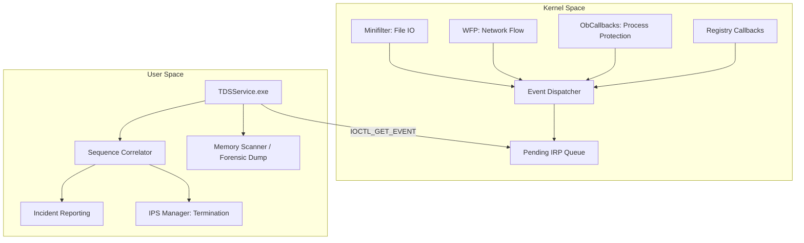

# Threat Detection Suite (TDS)

Event-driven EDR core for Windows. Implementation focuses on kernel-mode interception and real-time forensic analysis.

## Technical Architecture

The core utilizes an Inverted Call Model to provide asynchronous telemetry from the kernel to the user-mode service.



### Core Interception Mechanisms

- **Process & Thread Monitor**: Intercepts `CREATE_SUSPENDED` events and remote thread creations. Implements path validation for system processes.
- **Network Filtering (WFP)**: Callouts for IPv4/v6 and UDP/DNS telemetry without user-mode hooking.
- **File System Monitoring (Minifilter)**: Post-operation interception of IRPs to identify anomalous entropy and file modifications.
- **Self-Protection**: Enforces handle stripping via `ObRegisterCallbacks` to prevent unauthorized termination or memory access.

## Operational Specifications

- **Execution Model**: Push-based architecture triggered by kernel callbacks.
- **IPC Interface**: Asynchronous I/O via pending IRPs for immediate event delivery.
- **Forensic Engine**: Implementation of `MiniDumpWriteDump` for automated evidence collection on detections.

## Deployment

### Prerequisites
- Windows 10/11 x64 (Test Signing Enabled)
- Visual Studio 2022 + WDK

### Build and Load
```powershell
cmake -B build
cmake --build build --config Release
sc create TDSDriver type= kernel binPath= C:\path\to\TDSDriver.sys
sc start TDSDriver
```

## Notice
Developed by The Developer for security research and audit purposes. Finalized April 6, 2026.
