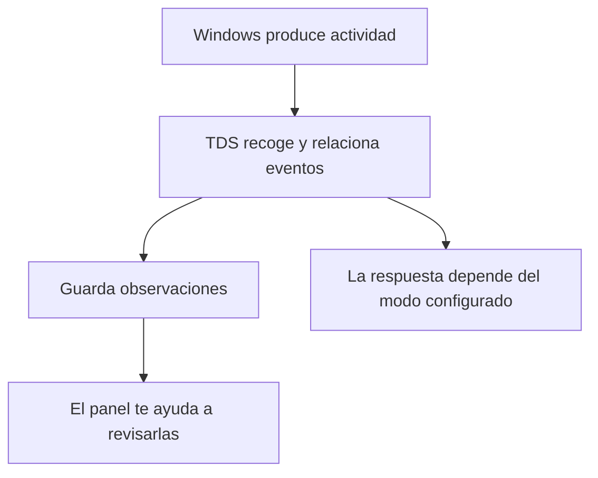

# Threat Detection Suite

TDS recoge actividad de Windows y guarda observaciones que ayudan a investigar comportamientos inusuales. El panel permite leerlas, buscar una aplicación y abrir los datos de cada evento sin tener que recorrer líneas de código.

[Ver comprobaciones](https://github.com/genesisgzdev/threat-detection-suite/actions) · [Instalación y uso](docs/USO.md) · [Cómo funciona](docs/ARCHITECTURE.md)

## Ya tienes TDS instalado

Abre PowerShell dentro de la carpeta del proyecto y comprueba su estado:

```powershell
.\tools\doctor.ps1
```

El diagnóstico te dice si el servicio está en marcha, si el controlador adicional está activo y dónde espera encontrar el informe. Distingue un problema que impide funcionar de una función opcional que aún no está disponible.

Para abrir el panel necesitas Python 3.10 o posterior:

```powershell
python tools/monitor.py
```

Abre **http://127.0.0.1:8765** en tu navegador. El panel lee los eventos reales cada tres segundos. Puedes buscar por palabras o proceso y filtrar por prioridad. Cerrar el panel no detiene el servicio.

## Entender una observación

| Lo que ves | Qué significa |
| --- | --- |
| Revisión prioritaria | Conviene investigar pronto la observación y su contexto |
| Proceso | Identificador de la aplicación asociada al evento |
| Observación original | Datos guardados por TDS para revisar el detalle |
| No hay archivo o eventos | No hay datos legibles en esa ruta; no demuestra que el equipo esté protegido |
| Controlador no activo | No está disponible la recogida adicional que depende de él |

TDS observa por defecto. Una alerta no es una sentencia sobre una aplicación. Los modos que intervienen en conexiones o procesos requieren configuración expresa y validación en el entorno donde se usan.


```mermaid
flowchart TD
    A["Windows produce actividad"] --> B["TDS recoge y relaciona eventos"]
    B --> C["Guarda observaciones"]
    C --> D["El panel te ayuda a revisarlas"]
    B --> E["La respuesta depende del modo configurado"]
```

## Todavía no lo has instalado

TDS incluye código de un servicio de Windows y de un controlador que se compila por separado. No es un instalador universal ni un antivirus certificado listo para cualquier equipo. La [guía de instalación](docs/USO.md) separa la compilación, la instalación del servicio y la validación del controlador.

Para compilar el servicio necesitas Windows, Visual Studio 2022 con herramientas C++ y CMake:

```powershell
cmake -S . -B build -G "Visual Studio 17 2022" -A x64 -DTDS_ENABLE_YARA=OFF
cmake --build build --config Release --parallel
ctest --test-dir build -C Release --output-on-failure
```

El controlador necesita además Windows Driver Kit y una firma aceptada por Windows. La compilación del servicio no comprueba que el controlador esté instalado o funcionando.

## Encontrar el detalle

La [guía](docs/USO.md) explica las rutas de archivos, los mensajes y cómo detener el servicio. La [arquitectura](docs/ARCHITECTURE.md) explica las colas, el controlador y la respuesta. El [mapa de archivos](docs/REPOSITORY_MAP.md) enlaza con cada parte del código.

En Linux puedes comprobar las herramientas y contratos con `bash build.sh` y `python -m unittest discover -s tests -p "test_*.py"`. Esas comprobaciones no producen un ejecutable Windows.

Licencia [MIT](LICENSE).
