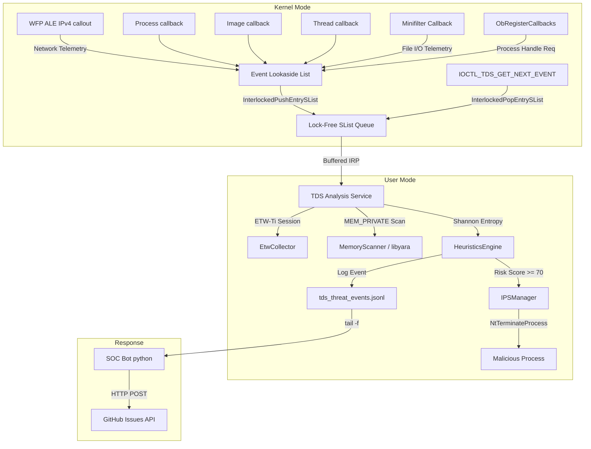

# Threat Detection Suite (TDS)

> **Development status:** TDS is an active Windows 10/11 x64 engineering project.
> The user-mode event contract, bounded kernel queue, service ingestion path and
> observe-first response policy are being hardened. Do not deploy the driver on
> production hosts until the Windows/WDK, Driver Verifier and isolated ATT&CK
> acceptance suites pass. The default response mode is `observe`.

## Runtime configuration

- `TDS_RESPONSE_MODE=observe|alert|contain|terminate` controls staged response.
- `TDS_LOG_PATH` selects the JSONL output path; the default is the current working directory.
- `TDS_FORENSICS=1` enables critical-alert process dumps; it is disabled by default.
- `TDS_ENABLE_YARA` is a CMake option and defaults to `OFF` unless a YARA SDK is supplied.

## System Architecture

The Threat Detection Suite (TDS) operates across two primary execution rings: Kernel-Mode (Ring 0) and User-Mode (Ring 3). This separation ensures that high-latency heuristic analysis does not induce system-wide DPC (Deferred Procedure Call) latency or bug checks (BSOD).

```mermaid
graph TD;
    subgraph Ring 0 [Kernel Mode]
        WFP[WFP ALE IPv4 callout] --> |Network Telemetry| EL[Event Lookaside List];
        PROC[Process callback] --> EL;
        IMG[Image callback] --> EL;
        THR[Thread callback] --> EL;
        MF[Minifilter Callback] --> |File I/O Telemetry| EL;
        OB[ObRegisterCallbacks] --> |Process Handle Req| EL;
        EL --> |InterlockedPushEntrySList| SList[Lock-Free SList Queue];
        IOCTL[IOCTL_TDS_GET_NEXT_EVENT] --> |InterlockedPopEntrySList| SList;
    end

    subgraph Ring 3 [User Mode]
        SList --> |Buffered IRP| Svc[TDS Analysis Service];
        Svc --> |ETW-Ti Session| ETW[EtwCollector];
        Svc --> |MEM_PRIVATE Scan| YARA[MemoryScanner / libyara];
        Svc --> |Shannon Entropy| Heuristics[HeuristicsEngine];
        Heuristics --> |Risk Score >= 70| IPS[IPSManager];
        IPS --> |NtTerminateProcess| Threat[Malicious Process];
        Heuristics --> |Log Event| Log[tds_threat_events.jsonl];
    end
    
    subgraph Automation [Response]
        Log --> |tail -f| Bot[SOC Bot python];
        Bot --> |HTTP POST| GitHub[GitHub Issues API];
    end
```

## Core Implementation Details

### 1. Windows Filtering Platform (WFP)
El driver registra hoy un sublayer dinámico y un callout en `FWPS_LAYER_ALE_AUTH_CONNECT_V4`. El callback observa conexiones IPv4 y, cuando la política permite containment, bloquea el caso implementado para tráfico remoto al puerto 53 con tamaño superior a 512 bytes. No se debe leer este código como cobertura IPv6 o de `DATAGRAM_DATA`: esas capas no están registradas en el camino actual.

### 2. Lock-Free Telemetry Queuing
Traditional `KSPIN_LOCK` synchronization in high-I/O environments (such as ransomware encrypting a drive) causes severe processor contention.
- **Memory Allocation**: The driver initializes an `NPAGED_LOOKASIDE_LIST` during `DriverEntry`. High-frequency callbacks allocate event buffers from this pool, guaranteeing constant-time, fragmentation-free allocation.
- **Queueing**: Events are pushed to an `SLIST_HEADER` using `InterlockedPushEntrySList`. The user-mode service retrieves them via `IOCTL_TDS_GET_NEXT_EVENT` using `InterlockedPopEntrySList`. This completely eliminates spinning waits.

### 3. IOCTL boundary and queue pressure
Los IOCTL usan `METHOD_BUFFERED`, validan tamaño, versión, flags y límites antes de copiar datos. `IOCTL_TDS_GET_QUEUE_STATS` expone profundidad y eventos descartados; cuando la cola llega a `EVENT_QUEUE_LIMIT`, el driver descarta el evento y aumenta el contador en vez de crecer sin límite. La fuzzing de IRP, Driver Verifier y las pruebas de unload siguen siendo validación nativa pendiente.

El `EventBus` de user-mode mantiene una segunda cola acotada para el análisis. Sus métricas separan profundidad actual, máximo observado, descartados totales y descartados por tipo de evento. Un descarte en cualquiera de las dos colas significa telemetría incompleta; no se interpreta como ausencia de actividad.

### 4. Process Tamper Protection
Protection of critical processes (such as LSASS and the TDS user-mode service) is implemented via `ObRegisterCallbacks`.
- **Identity**: the service PID is captured from the process that successfully sets the policy through the device IOCTL. LSASS still uses `PsGetProcessSignatureLevel()` and a system path check. The service path is not used as an authorization primitive.
- **Access Stripping**: Handles requesting `PROCESS_TERMINATE`, `PROCESS_VM_WRITE`, `PROCESS_SUSPEND_RESUME`, or `PROCESS_CREATE_THREAD` against protected PIDs have those flags stripped from their `DesiredAccess` mask by the kernel.

### 5. Minifilter Reentrancy Prevention
To prevent infinite recursion deadlocks—where the EDR intercepts its own log writes—the driver implements requestor-awareness.
- `TDSPreWriteCallback` invokes `FltGetRequestorProcess()`. If the originating process is the TDS user-mode service, the IRP is skipped (`FLT_PREOP_SUCCESS_NO_CALLBACK`).
- The registration currently covers writes. Paging-I/O exclusion is not claimed by the source and must not be inferred from the documentation.

### 6. User-Mode Memory Scanning and YARA
The `MemoryScanner` class integrates `libyara` directly into the C++ runtime.
- It iterates through the virtual address space of running processes, specifically targeting `MEM_PRIVATE` pages with `PAGE_EXECUTE_READWRITE` or `PAGE_EXECUTE_READ` protections.
- **Direct Syscalls & Stack Pivoting**: The scanner statically searches for `0x0F 0x05` (syscall) instructions outside of `ntdll.dll` boundaries, and uses `NtQueryInformationThread` to verify that the current stack pointer resides within the bounds defined by the Thread Environment Block (TEB).

### 7. Automated Incident Response (SOC Bot)
The `tools/soc/soc_bot.py` script provides real-time automated reporting.
- It performs a non-blocking `tail` on the `tds_threat_events.jsonl` log file.
- When an event with `HIGH` or `CRITICAL` severity is written by the `HeuristicsEngine`, the bot constructs a Markdown report and pushes it to the GitHub Issues API using standard HTTPS requests.
- The bot relies strictly on environment variables (`GITHUB_TOKEN`, `TDS_LOG_PATH`), containing no hardcoded local paths or credentials.
