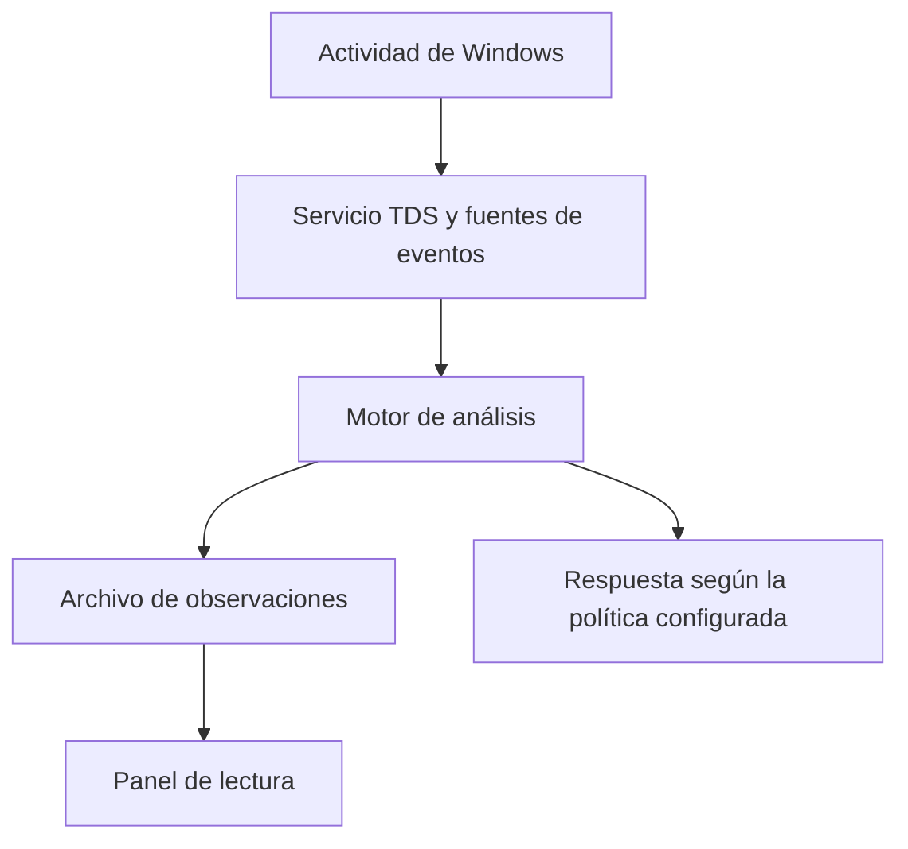

# Cómo llega una observación al panel

TDS recoge eventos de Windows, relaciona señales y escribe observaciones. El panel solo lee ese archivo. No participa en las decisiones del servicio ni cambia su modo de respuesta.

## Recorrido de los datos

Windows proporciona fuentes de eventos llamadas ETW. El controlador añade observaciones desde otras partes del sistema. El servicio abre ese controlador, aplica su política y vuelve a conectar si pierde el acceso. El servicio y el controlador son componentes que se compilan e instalan por separado.

## Qué hace cada parte

| Pieza | Trabajo |
| --- | --- |
| `TDSDriver` | Recoger eventos y aplicar la política admitida por el controlador |
| `TDSService` | Mantener el servicio, sus conexiones y el ciclo de trabajo |
| `TDSEngine` | Relacionar eventos y ejecutar los detectores |
| `Logger.h` | Guardar observaciones como una línea JSON por evento |
| `tools/monitor.py` | Leer eventos recientes desde una ruta fija |
| `tools/monitor.html` | Presentar búsqueda, prioridades y detalle original |
| `tools/doctor.ps1` | Explicar el estado observable de la instalación |

La lista de procesos, imágenes, hilos, conexiones y cambios del registro llega por fuentes diferentes. El motor conserva separados emisor y objetivo cuando el evento permite identificarlos. Si falta el objetivo, no lo inventa para ejecutar una respuesta.

## Identidad, orden y capacidad

Un identificador de proceso puede reutilizarse. Por eso se descarta el contexto anterior cuando aparece una nueva creación y no se conserva esa identidad entre reinicios del servicio.

El controlador verifica acceso, tamaño y versión de cada petición. La política exige permiso de escritura; leer eventos exige permiso de lectura. La sesión protegida conserva una referencia al proceso real que la estableció. No confía solo en su nombre.

Las colas tienen capacidad finita y exponen sus descartes. Una ráfaga no puede consumir memoria sin límite. La cola de análisis usa las marcas de tiempo para ordenar eventos recibidos, pero no promete un orden universal entre proveedores que entregan eventos tarde.

Las respuestas automáticas excluyen procesos críticos y no se habilitan por abrir el panel. El modo inicial es `observe`.

## Guardado y lectura

El servicio vacía el búfer durante su ciclo de trabajo y después de apagar el motor. El escritor escapa los caracteres de control para mantener líneas JSON legibles. Si falla el archivo, conserva un búfer acotado y emite un aviso por el canal de diagnóstico de Windows. Las reintentos tras una escritura parcial pueden repetir datos; un búfer lleno puede descartar eventos nuevos. Esas situaciones requieren atención operativa.

El panel relee el último MiB del archivo y muestra por defecto 200 eventos recientes. `--limit` permite cambiar la cantidad presentada. Reabrir el archivo en cada consulta permite seguir reemplazos y rotaciones. Una última línea incompleta espera a la siguiente lectura.

El servidor del panel escucha solo en `127.0.0.1`, rechaza nombres de host ajenos y no permite elegir archivos mediante peticiones web. Los datos se insertan como texto, nunca como HTML ejecutable. No ofrece acciones de control del servicio ni exporta datos a servicios externos.

## Integraciones y validación

YARA se habilita al compilar con su SDK. SOC y OTLP son herramientas separadas que consumen datos. El exportador conserva su punto de lectura y reintenta entregas; pueden existir duplicados. Configurar un proveedor externo sin implementación no añade inteligencia automáticamente.

| Comprobación | Qué verifica |
| --- | --- |
| Python en Linux | Herramientas, lectura de eventos y contratos del repositorio |
| Compilación Windows | Servicio y utilidades con MSVC |
| CTest de Windows | Comportamientos concretos de colas, registro y ayuda |
| Contratos del controlador | Formatos, permisos y estructura del código |
| Instalación WDK en un entorno de pruebas | Carga y comportamiento real del controlador |

Ninguna fila sustituye a las otras. El panel distingue un archivo vacío de un equipo sin problemas y el diagnóstico no confunde un servicio instalado con uno que está en marcha.

[Guía de instalación y uso](USO.md) · [Mapa de archivos](REPOSITORY_MAP.md)
