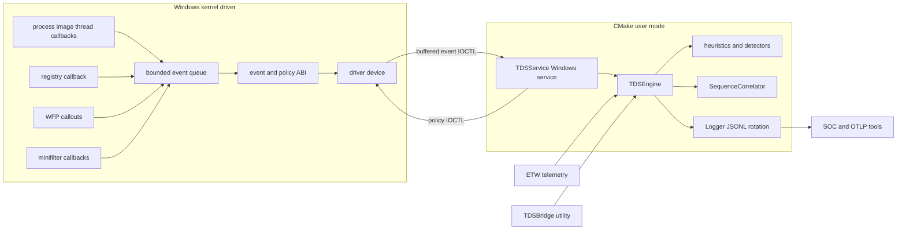
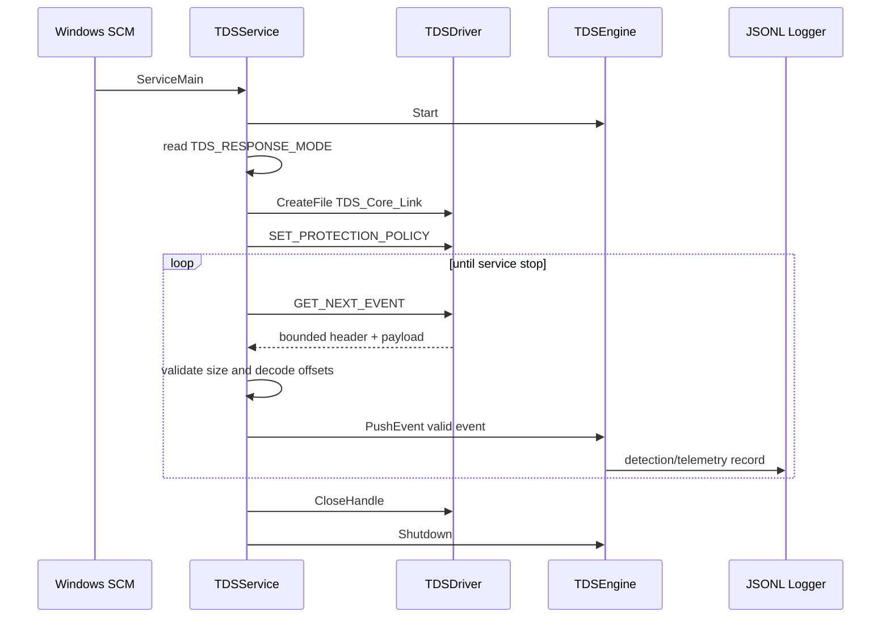

# Threat Detection Suite architecture

TDS tiene dos fronteras distintas: el driver WDK en kernel y los ejecutables CMake de user mode. Las herramientas SOC y OTLP están fuera del camino de decisión del servicio.

## Cómo leerlo

La primera figura muestra el camino de un evento. La secuencia muestra el arranque y el apagado. La última tabla indica qué se puede comprobar en Linux, qué requiere Windows y qué necesita una máquina aislada. Las líneas opcionales son integraciones separadas.

## 1. Componentes y contratos

Precisión de build:

- CMake compila `TDSCore`, `TDSService` y `TDSBridge` en Windows.
- `ThreatDetectionSuite/TDSDriver/TDSDriver.vcxproj` se compila con WDK por separado.
- `build.sh` en Linux solo ejecuta checks de contratos y repositorio; no genera el driver ni un binario Windows.
- YARA es opcional en CMake y se activa con un SDK localizado por `TDS_YARA_ROOT`.

## 2. Arranque y ciclo de eventos

`observe` queda como política inicial. `contain` y `terminate` solo cambian los flags enviados al driver; no son evidencia de que la contención o terminación haya sido validada en una instalación Windows real.

Las señales de hilo remoto, APC y ETW-TI conservan separado el proceso emisor del proceso objetivo cuando el ABI lo entrega. El collector ETW conserva el emisor y marca el objetivo como desconocido cuando aún no puede decodificarlo; en ese caso el correlador no inventa un target y las respuestas automáticas quedan suprimidas. La secuencia de APC antes de la primera imagen o actividad de hilo se marca como inicialización temprana, no como prueba definitiva de Early Bird. El motor de heurísticas borra el contexto anterior al recibir un nuevo evento de creación para que un PID reciclado no herede puntuación. El estado del correlador vive solo durante el proceso del servicio: no se persiste entre reinicios porque un PID no es una identidad durable.

## 3. Seguridad de la frontera kernel/user

- Policy IOCTL exige `FILE_WRITE_ACCESS`, tamaño exacto, versión 1, flags conocidos y campos reservados en cero.
- `TDS_POLICY_FLAG_PROTECT_SERVICE` habilita el filtrado de handles del proceso del servicio y de la imagen LSASS verificada; `TDS_POLICY_FLAG_ENABLE_WFP` y `TDS_POLICY_FLAG_ENABLE_MINIFILTER` habilitan respectivamente la telemetría de WFP y minifilter. Cada callback consulta la policy vigente antes de emitir o bloquear.
- Event IOCTL exige `FILE_READ_ACCESS`, buffer de salida suficiente y el límite `MAX_EVENT_BUFFER_SIZE`.
- Si el buffer de salida no alcanza para un evento válido, el driver lo vuelve a insertar y devuelve el tamaño requerido; esa consulta no se cuenta como pérdida.
- El device limita el acceso mediante ACL y los bits del IOCTL. Tras una policy válida, el driver conserva una referencia al objeto `PEPROCESS` que estableció la sesión protegida, no un nombre ni un PID; limpia esa referencia cuando el proceso termina. El servicio vuelve a abrir el device si se desconecta.
- La cola kernel->user es acotada para que el flujo de eventos no convierta una ráfaga en crecimiento sin límite de memoria. La cola de análisis user-mode también expone profundidad, high-water mark y descartes por tipo para hacer visible la presión de transporte.
- El driver usa una `SLIST` LIFO; al entrar al `EventBus`, la cola de análisis prioriza el `Timestamp` compartido para no invertir una ráfaga antes de heurísticas y correlación. Esto no corrige eventos tardíos entre proveedores ni establece un orden total que el ABI no entregue.

## 4. Qué prueba cada gate

| Gate | Prueba | No prueba |
| --- | --- | --- |
| `build.sh` | contratos ABI y estructura del repo en Linux | compilación o runtime Windows |
| user-mode CI | compilación MSVC de CMake | instalación/carga del driver |
| driver contract | access bits, IOCTL y lifecycle estáticos | callback real, WFP real, firma |
| laboratorio WDK | driver instalado y observado | seguridad universal en todos los Windows |
